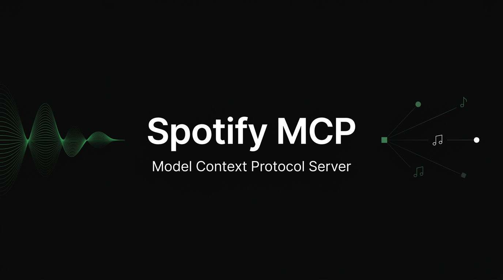

<div align="center">
  
</div>

<br/>

<div align="center">

[](https://golang.org)
[](https://modelcontextprotocol.io)
[](https://developer.spotify.com)
[](https://hub.docker.com)

**Talk to your music. Control Spotify through any AI assistant.**

[What it does](#what-it-does) · [Quick start](#quick-start) · [Tools](#tools) · [Configuration](#configuration)

</div>

---

## What it does

Spotify MCP is a **[Model Context Protocol](https://modelcontextprotocol.io)** server that bridges your AI assistant and Spotify. Connect Claude, Cursor, or any MCP client — then control your music in plain language.

```
"Play something like Arctic Monkeys but more chill"
→ search → play_music

"Create a playlist from the last 10 songs I heard"
→ list_recently_played → create_playlist → append_playlist_tracks

"What's playing? Turn it down a bit."
→ now_playing → set_volume
```

No device IDs. No URIs. No manual API calls. Just ask.

---

## Architecture

```
  AI Assistant (Claude / Cursor / any MCP client)
         │
         │  MCP over SSE
         ▼
  ┌──────────────────────────────────┐
  │         Spotify MCP Server       │
  │                                  │
  │  Tools ──▶ Service ──▶ Handler   │
  │              │                   │
  │    smart device resolution       │
  │    OAuth2 auto-refresh           │
  └─────────────────┬────────────────┘
                    │  HTTPS
                    ▼
           Spotify Web API
```

**Design principles:**
- **Zero secrets in code** — everything via env vars
- **Auto-rotating tokens** — OAuth2 refresh handled transparently
- **Smart device resolution** — set `SPOTIFY_DEVICE_NAME` once, never pass `device_id` again
- **Clean interface boundary** — `SpotifyProvider` is fully mockable for testing

---

## Quick start

### 1 — Get credentials

Create an app at [developer.spotify.com/dashboard](https://developer.spotify.com/dashboard) and generate a refresh token with these scopes:

```
user-read-playback-state  user-modify-playback-state  user-read-currently-playing
playlist-read-private  playlist-modify-public  playlist-modify-private
user-library-read  user-read-recently-played
```

> Need help getting a refresh token? Spotify's [Authorization Guide](https://developer.spotify.com/documentation/web-api/concepts/authorization) walks you through PKCE flow.

### 2 — Configure

```bash
cp .env.example .env
```

```env
SPOTIFY_CLIENT_ID=your_client_id
SPOTIFY_CLIENT_SECRET=your_client_secret
SPOTIFY_REFRESH_TOKEN=your_refresh_token

# Optional but recommended — skip device_id on every call
SPOTIFY_DEVICE_NAME=My Speaker
```

### 3 — Run

**Go**
```bash
go run .
```

**Docker**
```bash
docker-compose up
```

Server starts at `http://localhost:8080`.

### 4 — Connect your AI

**Claude Desktop** — `~/Library/Application Support/Claude/claude_desktop_config.json`
```json
{
  "mcpServers": {
    "spotify": {
      "url": "http://localhost:8080/sse"
    }
  }
}
```

**Cursor** — MCP settings
```json
{
  "spotify": { "url": "http://localhost:8080/sse" }
}
```

---

## Tools

16 tools across 5 categories.

### Search & Discovery
| Tool | Description |
|---|---|
| `search` | Search tracks, albums, artists, or playlists — returns URIs |

### Playback
| Tool | Description |
|---|---|
| `play_music` | Play any Spotify URI (track, album, artist, playlist) |
| `pause_playback` | Pause the current session |
| `resume_playback` | Resume a paused session |
| `skip_next` | Skip to the next track |
| `skip_previous` | Go back to the previous track |

### Devices & Volume
| Tool | Description |
|---|---|
| `list_devices` | List all Spotify Connect devices |
| `transfer_playback` | Move the session to a different device |
| `set_volume` | Set volume 0–100 |
| `now_playing` | Get current track, device, progress, shuffle state |

### Playlists
| Tool | Description |
|---|---|
| `list_playlists` | List the user's playlists |
| `get_playlist` | Fetch a playlist by ID |
| `get_playlist_tracks` | Get tracks inside a playlist |
| `create_playlist` | Create a new playlist, optionally seeded with tracks |
| `append_playlist_tracks` | Add tracks to an existing playlist |

### Library
| Tool | Description |
|---|---|
| `list_recently_played` | Recently played tracks |
| `list_saved_tracks` | Liked songs |

---

## Configuration

| Variable | Required | Description |
|---|---|---|
| `SPOTIFY_CLIENT_ID` | ✅ | Spotify app client ID |
| `SPOTIFY_CLIENT_SECRET` | ✅ | Spotify app client secret |
| `SPOTIFY_REFRESH_TOKEN` | ✅ | OAuth2 refresh token |
| `SPOTIFY_DEVICE_NAME` | — | Auto-resolve device by name (recommended) |
| `SPOTIFY_DEVICE_ID` | — | Explicit device ID — overrides name lookup |
| `PORT` | — | HTTP port (default: `8080`) |

### Device resolution

When `SPOTIFY_DEVICE_NAME` is set, the server resolves the device ID on first call, caches it, and injects it silently into every playback operation. If the device goes offline and the cache goes stale, it's invalidated automatically on the next device error.

Without it, you'll need to call `list_devices` and pass `device_id` manually.

---

## Project structure

```
├── main.go                  # Entrypoint — config → server → listen
├── config/
│   └── config.go            # Env-based config with fail-fast validation
├── types/
│   ├── interfaces.go        # SpotifyProvider — the core abstraction
│   └── spotify.go           # Domain types: Track, Playlist, Device, …
├── internal/
│   ├── server.go            # MCP SSE server lifecycle
│   ├── service.go           # Business logic + device resolution cache
│   ├── tools.go             # 16 MCP tools + input schemas + formatters
│   └── spotify/
│       ├── handler.go       # Spotify Web API client (OAuth2 + HTTP)
│       └── mapper.go        # API responses → domain types
├── Dockerfile
└── docker-compose.yml
```

---

<div align="center">
  <sub>Built with Go · Spotify Web API · Model Context Protocol</sub>
</div>
